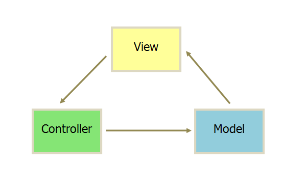
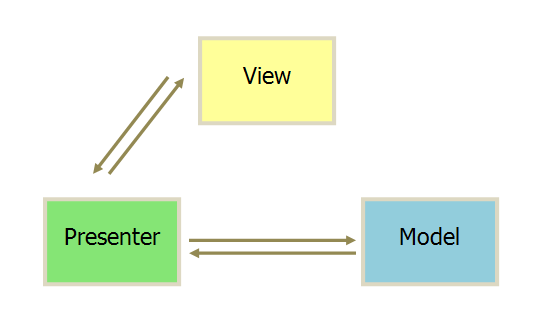

<script setup>
import MvcTodolistComponent from '../.vitepress/components/MvcTodolist.vue'
import MvpTodolistComponent from '../.vitepress/components/MvpTodolist.vue'
import MvvmTodolistComponent from '../.vitepress/components/MvvmTodolist.vue'
</script>


在这篇文章中，我们将学习软件开发中的三种主要架构模式：MVC、MVP 和 MVVM。以及每种模式的核心概念、区别。并用一个简单的`todo List`小应用来分别展示这三种模式在前端开发中该怎么用起来。

## MVC

### 由来

MVC（Model-View-Controller）是最早的前端架构模式之一，由 Trygve Reenskaug 在 1979 年提出，它将应用程序分为三个部分：`模型（Model）`、`视图（View）`和`控制器（Controller）`。

### 核心概念

- 模型（Model）：负责管理应用程序的数据和业务逻辑。
- 视图（View）：负责展示数据，即用户界面。
- 控制器（Controller）：负责接收用户的输入，调用模型进行相应的处理，并更新视图。
  MVC 的优点是实现了业务逻辑、数据和用户界面的分离，使得代码更加模块化，易于维护和扩展。但是，MVC 存在一些缺点，如控制器可能会变得非常臃肿，视图和模型之间的直接通信可能会导致代码耦合度较高。

### 通信方式



如上图所示MVC模式的通信是单向的：

1. View传送数据到Controller。
2. Controller完成业务逻辑后，要求Model改变状态。
3. Model将新的数据发送到View，用户得到反馈。

### 例子

一个使用MVC架构开发简单的todo list小应用。

<MvcTodolistComponent  />

代码示例：
::: code-group

```html [Html]
  <div>
    <input type="text" id="todoInput" placeholder="请输入待办事项" />
    <button id="addBtn">添加</button>
    <ul id="todoList"></ul>
  </div>
```
```js [View]
class TodoView {
  input;
  addTodoButton;
  todoList;
  constructor() {
    this.input = document.getElementById("todoInput");
    this.addTodoButton = document.getElementById("addBtn");
    this.todoList = document.getElementById("todoList");

  }
  render(todos) {
    this.todoList.innerHTML = "";
    todos.forEach((todo, index) => {
      const li = document.createElement("li");
      li.innerHTML = `${todo} <button class="delete" data-index=${index}>删除</button>`;
      todoList.appendChild(li);
    });
  }
}
```

```js [Model]
class TodoModel {
  todos = [];
  constructor() {
    this.todos = [];
  }
  addTodo(todo) {
    this.todos.push(todo);
  }
  removeTodo(index) {
    this.todos.splice(index, 1);
  }
}
```
```js [Controller]
class TodoController {
  constructor(model, view) {
    this.model = model;
    this.view = view;

    this.view.addTodoButton.addEventListener('click', () => this.addTodo());
    this.view.todoList.addEventListener('click', (event) => this.removeTodo(event));
  }
  addTodo() {
    const todoText = this.view.input.value.trim();
    if (todoText) {
      this.model.addTodo(todoText);
      this.view.input.value = '';
      this.view.render(this.model.todos);
    }
  }
  removeTodo(event) {
    if (event.target.className === 'delete') {
      const index = parseInt(event.target.dataset.index);
      this.model.removeTodo(index);
      this.view.render(this.model.todos);
    }
  }
}
```
```js [run]
onMounted(() => {
  const model = new TodoModel();
  const view = new TodoView();
  new TodoController(model, view);
})
```

:::

以上代码数据流向遵循以下路径：
1. 控制器接收输入：控制器（Controller）监听视图（View）中的用户交互事件（例如，点击按钮）。当这些事件发生时，控制器执行相应的逻辑。

    - 添加待办事项： a. 用户在输入框中输入待办事项的文本。 b. 用户点击“添加”按钮。 c. 控制器捕捉到按钮点击事件，并从视图中获取用户输入的文本。 d. 控制器调用模型（Model）的方法，传入待办事项文本以更新数据。

    - 删除待办事项： a. 用户点击待办事项旁的“删除”按钮。 b. 控制器捕捉到删除按钮的点击事件，并从事件对象中获取需要删除的待办事项的索引。 c. 控制器调用模型的方法，传入待办事项的索引以更新数据。
2. 模型更新数据：模型（Model）根据控制器（Controller）的调用更新其数据。
3. 视图渲染更新：每当模型（Model）的数据发生变化后，控制器控制视图（View）根据最新的模型数据重新渲染界面。

    - 控制器调用视图的render方法，将更新后的待办事项列表数据作为参数传递。
    - 视图根据传入的数据，动态创建并显示所有待办事项。

用户输入触发数据的变化（视图到模型），数据的变化反过来触发界面的更新（模型到视图）。数据处理逻辑、用户界面逻辑和控制逻辑被清晰地分离开来，这种模式确保了应用的高度模块化和易于维护。

## MVP

### 由来

MVP（Model-View-Presenter）的提出我在网上没有找到相关资料，大概是在 1990 年代晚期开始流行。他是MVC架构模式的一个变体。MVP架构模式背后的主要思想是将用户界面（View）与业务逻辑（Model）分离，并通过一个中间层（Presenter）来处理两者之间的交互。这种分离有助于提高代码的可维护性、可测试性和可重用性。MVP 将应用程序分为三个部分：`模型（Model）`、`视图（View）`和`中介者（Presenter）`。

### 核心概念

- 模型（Model）：与 MVC 中的模型相同，负责管理应用程序的数据和业务逻辑。
- 视图（View）：负责展示数据，即用户界面。在 MVP 中，视图不直接与模型通信，而是通过中介者进行通信。
- 中介者（Presenter）：负责接收用户的输入，调用模型进行相应的处理，并更新视图。
  MVP 的优点是进一步降低了视图和模型之间的耦合度，使得代码更加模块化。但是，MVP 也存在一些缺点，如中介者可能会变得非常臃肿，因为它需要处理视图和模型之间的所有通信。

### 通信方式


MVP模式的通信方式：
1. 各部分之间的通信是双向的。
2. View与Model不发生联系，都通过Presenter传递。
3. View非常薄，不部署任何业务逻辑，称为“被动式图”（Passive View），即没有任何主动性，而Presenter非常厚，所有逻辑都部署在这里。

### 例子

一个使用MVP架构开发简单的todo list小应用。

<MvpTodolistComponent  />

代码示例：
::: code-group

```html [Html]
  <div>
    <input type="text" id="todoInput2" placeholder="请输入待办事项2" />
    <button id="addBtn2">添加</button>
    <ul id="todoList2"></ul>
  </div>
```
```js [View]
class TodoView {
  input;
  addTodoButton;
  todoList2;
  constructor() {
    this.input = document.getElementById("todoInput2");
    this.addTodoButton = document.getElementById("addBtn2");
    this.todoList2 = document.getElementById("todoList2");
  }
  addTodoHandler(handler) {
    this.addTodoButton.onclick = handler;
  }

  removeTodoHandler(handler) {
    this.todoList2.onclick = handler;
  }
  render(todos) {
    this.todoList2.innerHTML = "";
    todos.forEach((todo, index) => {
      const li = document.createElement("li");
      li.innerHTML = `${todo} <button class="delete" data-index=${index}>删除</button>`;
      todoList2.appendChild(li);
    });
  }
}
```

```js [Model]
class TodoModel {
  todos = [];
  constructor() {
    this.todos = [];
  }
  addTodo(todo) {
    this.todos.push(todo);
    return this.todos;
  }
  removeTodo(index) {
    this.todos.splice(index, 1);
    return this.todos;
  }
}
```
```js [Presenter]
class TodoPresenter {
  constructor(model, view) {
    this.model = model;
    this.view = view;

    this.view.addTodoHandler(() => this.addTodo());
    this.view.removeTodoHandler((event) => this.removeTodo(event));
  }
  addTodo () {
    const todoText = this.view.input.value.trim();
    if (todoText) {
      const newTodos = this.model.addTodo(todoText);
      this.view.input.value = '';
      this.view.render(newTodos);
    }
  }
  removeTodo(event) {
    if (event.target.className === 'delete') {
      const index = parseInt(event.target.dataset.index);
      const newTodos = this.model.removeTodo(index);
      this.view.render(newTodos);
    }
  }
}
```
```js [run]
onMounted(() => {
  const model = new TodoModel();
  const view = new TodoView();
  new TodoPresenter(model, view);
})
```

:::

以上代码数据流向遵循以下路径：
1. 用户交互：用户通过视图（View）与应用程序交互，例如输入新的待办事项或点击删除按钮。

2. 视图通知Presenter：视图不直接修改数据，而是通过调用Presenter中的方法来响应用户的操作。

3. Presenter更新Model：Presenter接收来自视图的通知，并根据用户的操作（添加或删除待办事项）更新模型（Model）。

4. Model通知Presenter：模型直接返回更新后的数据给Presenter，而不是使用事件或观察者模式。在更复杂的应用中，模型可能会通知Presenter数据已经更改。

5. Presenter更新View：Presenter根据从模型获取的最新数据更新视图。

通过这种方式，MVP架构促进了关注点的清晰分离，其中模型负责数据和业务逻辑，视图负责用户界面，Presenter作为模型和视图之间的中介，负责处理大部分业务逻辑并更新视图。

## MVVM

### 由来

MVVM（Model-View-ViewModel）架构模式是由微软的WPF（Windows Presentation Foundation）和Silverlight团队在2005年左右提出的。在前端开发中，特别是前端SPA开发中，前端框架`React`，`Vue`，`Angular`等都是MVVM模式或者是其变体。MVVM模式的优势在于它能够提供清晰的职责划分，支持双向数据绑定，以及促进前端开发的工程化。

### 核心概念

- 模型（Model）：与 MVC 和 MVP 中的模型相同，负责管理应用程序的数据和业务逻辑。
- 视图（View）：负责展示数据，即用户界面。在 MVVM 中，视图不直接与模型通信，而是通过视图模型进行通信。
- 视图模型（ViewModel）：负责暴露模型的数据和命令，以便视图可以使用它们。视图模型通常使用数据绑定和命令绑定来实现视图和模型之间的通信。
  MVVM 的优点是进一步降低了视图和模型之间的耦合度，使得代码更加模块化。同时，MVVM 还支持双向数据绑定，使得视图和模型之间的数据同步更加简单。但是，MVVM 也存在一些缺点，如果视图模型没有封装好则可能会变得非常臃肿，因为它需要处理视图和模型之间的所有事件。

一般来说，MVVM架构需要借助第三方框架来实现数据的双向绑定，如Vue。

### 通信方式


MVVM模式的通信方式：
MVVM模式它采用双向绑定（data-binding）：View的变动，自动反应在ViewModel，反之亦然。Vue、Angular和React都采用这种模式。

### 例子

一个使用MVVM架构开发简单的todo list小应用。

<MvvmTodolistComponent  />

代码示例：
::: code-group

```html [View]
  <div>
    <input type="text" v-model="newTodo" placeholder="请输入待办事项3" />
    <button @click="addTodo">添加</button>
    <ul>
      <li v-for="(todo, index) in todos" :key="index">
        {{ todo }}
        <button @click="removeTodo(index)">删除</button>
      </li>
    </ul>
  </div>
```
```js [Model]
import { ref } from "vue";

const newTodo = ref('');
const todos = ref([]);
```

```js [ViewModel]
const addTodo = () => {
  if (newTodo.value.trim()) {
    todos.value.push(newTodo.value);
    newTodo.value = '';
  }
};

const removeTodo = (index) => {
  todos.value.splice(index, 1);
};
```

:::

以上代码数据流向遵循以下路径：
1. Model（模型）：在Vue中通常是响应式的数据，如示例中的todos数组和newTodo字符串。它们代表应用程序的状态。

2. View（视图）：HTML模板负责定义用户界面，通过Vue的指令（如v-for, v-model, @click等）与ViewModel绑定。

3. ViewModel：在Vue中，ViewModel是由Vue实例（或组件）中的响应式数据（如使用ref定义的数据）和方法（如addTodo和removeTodo函数）组成的。ViewModel负责协调视图和模型。它监听视图上的用户输入事件，更新模型，并观察模型上的数据变化，自动将更新反映到视图上。

通过这种方式，MVVM架构利用Vue的响应式特性和双向数据绑定，大大简化了数据与视图之间同步更新的复杂性，代码量大大的减少，使得开发者能够更加专注于业务逻辑，而不是如何操作DOM或手动同步数据。

## 总结
以上主要讨论 了几种常见的前端架构类型：MVC、MVP和MVVM。MVC 是最早的模式之一，它将应用分成三个部分，但在现代前端开发中，控制器的角色有时变得模糊，并且基本不采用这种架构进行前端开发。MVP 为视图和模型提供了更清晰的分离，将大部分逻辑放在Presenter中，简化了视图的职责，使其更加专注于UI的渲染。但开始需要操作DOM。MVVM 利用数据绑定特性，最小化了视图和模型之间同步状态的需要，减少了样板代码，使得开发更加高效，特别适合构建复杂的前端应用，所以基本现代的前端应用都是使用MVVM模式的第三方框架来开发。