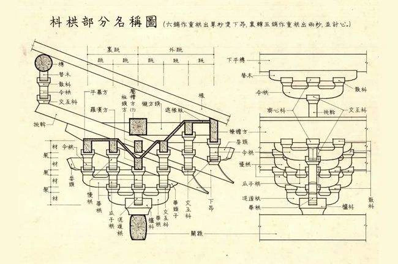
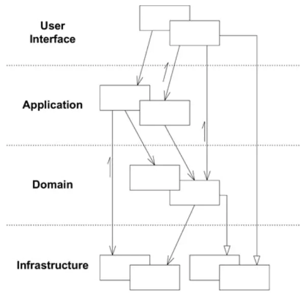
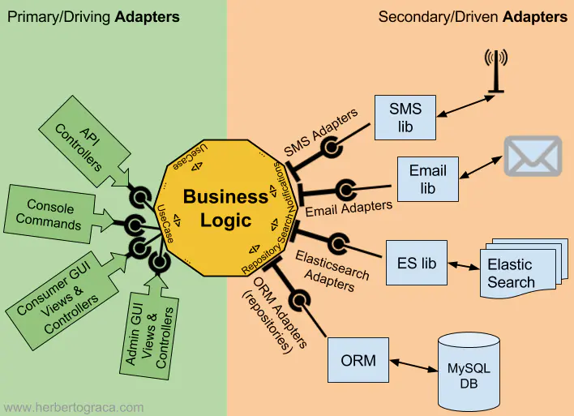
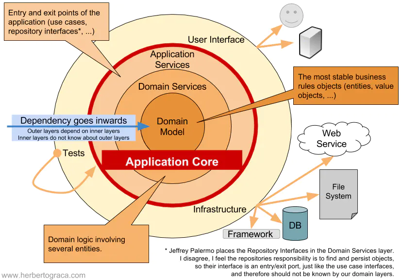
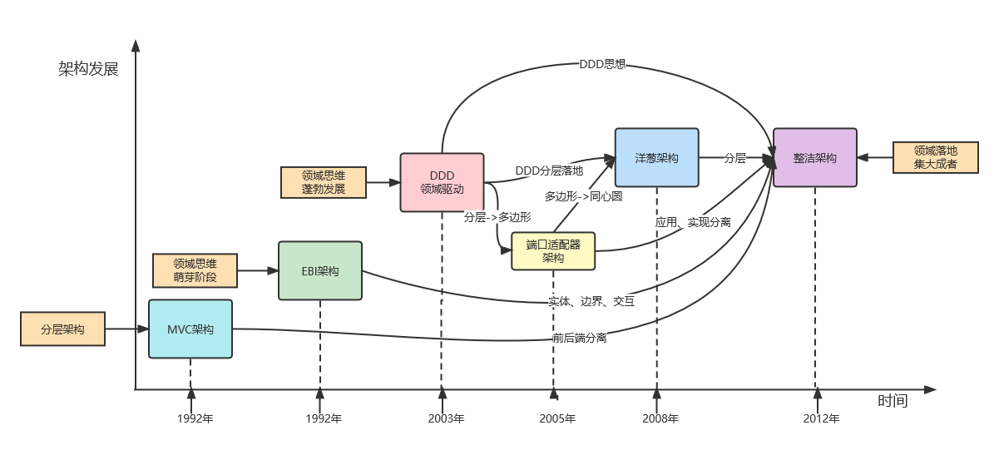

## 建筑架构

在介绍架构之前，我们可以先了解下在建筑领域的架构，下图为古代的木质建筑的结构图：

架构从字面意思上，是源于古代的建筑术语。把架构拆分成两个字“架”和“构”。“架”就是“加”和“木”的结合，把木头加起来、连接起来就是架。“构”就是结构的意思。所以，“架构”就是把“木“按照一定的结构连接起来。

对应到软件架构，这里面的“木”代表什么，软件架构中的“结构”是什么，这些软件系统的“木”又是如何连接的？

* 关联到软件领域，木就是系统中的要素，我们将他们称之为架构要素。架构要素可以是子系统、模块、应用服务。
* 结构，是架构的产物。不同的软件系统会有不同的结构，这些结构是为解决不同场景而设计的。
* 连接，通过定义架构元素之间的接口和交互关系、集成机制，实现架构元素之间的连接。连接可以是分布式调用、进程间调用、组件之间的交互关系等。

总结一下架构的本质，即架构=要素+结构+连接，将系统要素按照特定结构进行连接交互。

## 软件架构

百度百科对架构的定义：

> 架构又名软件架构，是有关软件整体结构与组件的抽象描述，用于指导大型软件系统各个方面的设计

**从定义中我们提炼出几个关键字：组件、结构、关系；**

* **组件**：也可以称为软件元素或者是架构要素。可以是子系统、模块、应用服务，取决于不同粒度来看待。
* **结构**：是架构之后的产出物，不同的软件系统会有不同结构，这些结构是为解决不同场景而设计。
* **关系**：实现架构组件之间的连接。连接关系可以是JVM内部调用、可以是组件之间、也可以是跨应用的分布式调用、也可以与外系统接口集成调用。

架构设计本质就是**解决软件复杂度**带来的问题，软件复杂度表现形式有很多种，比如业务复杂度、性能复杂度、可用性复杂度、可扩展性复杂度、安全复杂度等；任何一个系统都有它侧重解决的复杂度问题，理解每个架构方案背后需要真正解决的是软件复杂度的什么问题是评判一个架构设计目的性的关键因数，这也是做架构设计中常提的系统约束条件；

业务复杂度体现的是如何来拆解业务，找到合适软件元素和组件、按怎么结构进行连接；性能复杂度体现的是找到软件元素，进行合适连接形成一定结构，达到高性能要求。比如说一个大型ERP系统，属于业务复杂度高的系统，你该如何去拆分它，拆分成一个个独立完备具有明确业务边界的组件，这是做架构设计需要思考的。再比方说做一个秒杀系统，系统复杂度要求就是性能复杂度，怎么能在扛住秒杀的洪峰，这是性能复杂度需要解决的问题。

## 架构演变

### EBI架构（1992）

EBI 架构(Entity-Boundary-Interactor，实体-边界-交互器)是最早的一种架构模式,提出时间大约在 20 世纪 80 年代后期。它由 Ivar Jacobson 等人在他们的著作《Software Reuse: Architecture, Process and Organization for Business Success》中提出。

#### 核心

* **Entity实体**：实体对象承载着相关业务领域的数据和操作。对应着MVC的Model层。
* **Boundary边界**：边界对象是对系统接口的建模。所有依赖系统环境(工具和传达机制)的功能都属于边界对象。如 UI、数据库等。
* **Interactor交互器**：代表了展现层和实体之间的连接，也就是应用服务(业务逻辑)。

#### 优点

* 清晰的层次划分,职责分离明确，通过职责的封装将系统的变化控制在局部（最好是一个对象）。（**[单一职责原则](https://docs.google.com/open?id=0ByOwmqah_nuGNHEtcU5OekdDMkk)**）
* 实体和交互器相对稳定,边界层相对容易修改和替换。
* 有利于代码复用和可维护性。

#### 缺点

* 过于笼统,缺乏足够的指导和约束,存在实现上的自由度。
* 没有很好地解决跨层级通信的问题。
* 对大型复杂系统的支持能力有限。

### DDD领域驱动设计(2003)

DDD(Domain-Driven Design)架构是由 Eric Evans 在 2003 年提出的,主要面向复杂的业务领域建模。它强调将复杂的业务需求与技术实现相分离,专注于领域建模。DDD把实现分为4个大层次，如下图：

#### 核心

领域模型准确反映了业务语言，而传统数据对象除了简单setter/getter方法外，没有任何业务方法，即**失血模型**，那么DDD领域模型就是充血模型（业务方法定义在实体对象中），且对架构进行了清晰的分层：

* 1.**User Interface用户界面层**：负责绘制和应用交互的屏幕界面并将输入翻译成应用的命令。
* 2.**Application应用服务层**：协调领域对象完成用例。它不包含业务逻辑。应用层和EBI架构中的**Interactor交互器**相对应，只有一点不同，交互器是和界面或实体无关的任意对象，而这里应用层只包含和用例相关的对象。
* 3.**Domain领域层**：这个层次包含了所有的业务逻辑，如领域服务、实体、聚合、值对象、事件和其他包含业务逻辑的任意对象类型。它和 EBI 架构中的**Entity实体**对象类型对应。
* 4.**Infrastructure基础设施层**：支持上述三个层次的技术能力，例如，持久化或者消息机制。

#### 优点

* 首次清晰描述了领域驱动的分层实现并统一了业务语言。
* 单一职责、低耦合、高内聚、业务内核沉淀，降低了系统复杂度。
* 有利于代码的可维护性和可扩展性。
* 专注于领域建模,更贴近业务需求。

#### 缺点

* 学习曲线较陡峭,需要团队成员对 DDD 有深入理解。
* 如果领域模型业务逻辑不清楚，将会提高技术架构实现难度，提高系统复杂度。
* 在非常规业务领域中,领域模型的划分可能不太明确。

### 六边形架构（2005）

六边形架构(Hexagonal Architecture 或 Ports and Adapters)由 Alistair Cockburn 在 2005 年提出,被认为是对经典三层架构的改进。

> 让用户、程序、自动化测试和批处理脚本可以平等地驱动应用，让应用的开发和测试可以独立于其最终运行的设备和数据库。——Alistair Cockburn 2005，[端口和适配器](http://alistair.cockburn.us/Hexagonal+architecture)     如下图所示：

#### 核心

1. **左侧: 代表 UI 的适配器被称为主适配器，它们发起了对应用的一些操作，**端口（应用层API）和它的具体实现(controller实现)都在应用内部**。**
2. **右侧: 表示和后端工具链接的适配器，被称为从适配器，它们只会对主适配器的操作作出响应，**端口在应用内部(业务接口)，具体实现（impl）在应用之外**。**
3. 内核只依赖于抽象,而不依赖于具体实现。
4. 外部组件通过端口(Ports)和适配器(Adapters)与内核交互。

#### 优点

1. 业务应用和实现（技术）隔离。（面向接口编程）
2. 方便测试。（基于接口）
3. 支持不同的 UI、数据库等外部组件的集成和替换。

#### 缺点

* 增加了架构复杂性,可能加大团队的学习成本。
* 过度抽象可能导致不必要的复杂度。
* 对于简单系统来说,可能是过度设计。

### 洋葱架构(2008)

[洋葱架构](http://jeffreypalermo.com/blog/the-onion-architecture-part-1/)(Onion Architecture)由 Jeffrey Palermo 在 2008 年提出，可看作是六边形架构的一种变体。它将系统划分为多个环形层次，从内到外依次包括:

* Domain Model
* Application Services
* Infrastructure Services
* UI/Test

#### 核心

* 最内层是领域模型,代表业务规则和实体。
* 应用服务层构建于领域模型之上,封装应用程序特定的用例。
* 外层是基础设施服务,如数据访问、消息传递等。
* 最外层是 UI 或测试接口,完全依赖于内层。

#### 优点

* 职责分离更彻底，高内聚低耦合，有利于代码组织。
* 保持了内核的可测试性和可维护性。
* 相对于外层，内层具有很高的独立性和可替代性(有整洁架构的影子了)

#### 缺点

* 复杂系统中可能存在跨层通信的问题。
* 增加了架构的复杂度和学习成本。
* 对于一些简单系统,可能是过度设计。

### 整洁架构(2012)

[整洁架构](https://blog.cleancoder.com/uncle-bob/2012/08/13/the-clean-architecture.html)(The Clean Architecture)由 Robert C. Martin (Uncle Bob) 在 2012 年提出，被认为是洋葱架构的发展和延伸。这套架构是站在巨人的肩膀上，把MVC、EBI、端口适配器、洋葱架构、DDD融会贯通，形成了一套落地实践方案。

经典架构图：

#### 核心

1. 遵循依赖规则:源代码依赖关系须自内而外,内部无需了解外部。
2. 将代码划分为四个主要层次:实体、用例、接口适配器、框架与驱动程序。
   * Enterprise Business Rules  企业级业务规则层(实体)：核心业务内聚（对应DDD的领域服务+领域实体）。
   * Application Business Rules 应用级业务规则层(用例)：应用层业务编排。
   * Interface Adapters              接口适配层：数据转化。
   * Frameworks & Drivers        框架和驱动层：底层实现和数据库等驱动。
3. 实体层包含了领域模型,是最内层和最重要的层次。
4. 外层依赖于内层,内层不依赖于外层(核心点）。

#### 优点

* 内层是可复用的、与外层无关的核心业务逻辑。
* 它告诉我们如何把所有的概念、规则和模式整合起来，形成一种标准实现套路。

#### 缺点

* 存在不少理论概念,学习曲线较陡。
* 增加了一些复杂性和间接层,对于小型项目可能有点过度设计。
* 跨层通信方面也存在一定的挑战。

## 总结

纵观EBI架构、DDD领域驱动设计、端口适配器架构、洋葱架构、整洁架构。完全没有冲突，就是领域设计的完美落地历史。也反映了软件工程领域对于架构设计理念的不断探索和发展。每种架构模式都试图从不同角度来应对软件复杂性、提高可维护性、降低系统耦合等方面的挑战。

早期的 EBI 架构为软件架构领域奠定了基础,提出了职责分离的概念。而 DDD 则更加聚焦于以领域模型为驱动的架构设计。六边形架构、洋葱架构和整洁架构这些更现代的架构则在此基础上,进一步强调了内核与外部组件的分离、可测试性的提高、层次和依赖关系的合理性等方面。

一张图归纳之:

